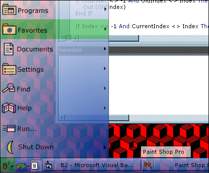



## B2 \(BoS 2\.0\) Preview \- Translucent skinnable desktop icon / taskbar replacement \- rewritten

### Description

*** Note: The B2 preview release will only run on Windows 98 / Windows ME (not tested) / Windows 2000. Many features have not yet been implemented. Be sure to copy Alphablending.dll to your C:\windows\system directory. Move the taskbar to the top of the screen before running for maximum usability.***

BoS is back... As B2. The BSoft Team (Florian and I) decided to COMPLETELY REPROGRAM the entire shell from the ground up - and this is the result. For starters, now all the images are external, dropping the size of the EXE to only 64K (that's 250K smaller than explorer), and allowing the shell to load up in under 3 seconds. The desktop icons have been moved to a new desktop icon menu, and a new QuickLaunch tray allows for quick launching of frequentlly used programs. Translucent tool tips are now implemented. B2 now automaticlly detects your desktop directory, so you don't have to edit a variable.

Being that this is a preview release, some features are missing. For one, no BApps or extra

skins have been included. Also, the start menu is missing functionality. Look for the full version in October.
 
### More Info
 
You like cool looking, fast, powerful desktops. You have Windows 98 / Windows ME / Windows 2000.

May make your desktop look very cool.

             |
---                |---
**Submitted On**   |2000-08-24 16:06:10
**By**             |[Brian](https://github.com/Planet-Source-Code/PSCIndex/blob/master/ByAuthor/brian.md)
**Level**          |Advanced
**User Rating**    |5.0 (119 globes from 24 users)
**Compatibility**  |VB 6\.0
**Category**       |[Complete Applications](https://github.com/Planet-Source-Code/PSCIndex/blob/master/ByCategory/complete-applications__1-27.md)
**World**          |[Visual Basic](https://github.com/Planet-Source-Code/PSCIndex/blob/master/ByWorld/visual-basic.md)
**Archive File**   |[CODE\_UPLOAD92868242000\.zip](https://github.com/Planet-Source-Code/brian-b2-bos-2-0-preview-translucent-skinnable-desktop-icon-taskbar-replacement-rewritten__1-10985/archive/master.zip)

